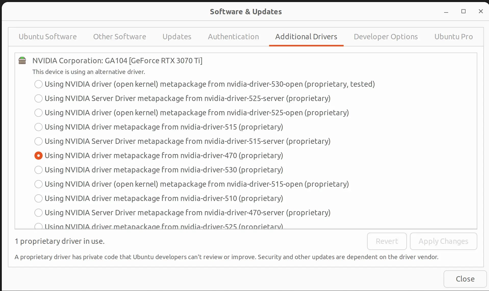
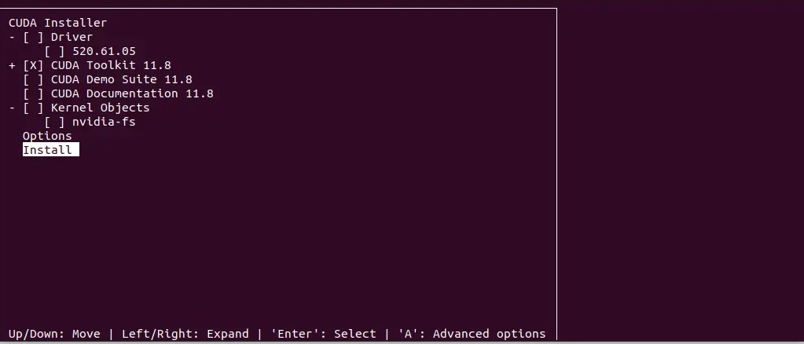

# Installing TensorFlow 2.12 and PyTorch 2.0

Machine learning has emerged as one of the most promising fields in the tech industry. With the ability to automate decision-making
processes, machine learning is transforming the way businesses and organizations operate. TensorFlow and PyTorch are two of the most widely
used deep learning frameworks in the machine learning community, offering a range of functionalities from building and training neural
networks to deploying them on various platforms. In this tutorial, we will guide you through the process of installing TensorFlow 2.6 and
PyTorch 1.9 on Ubuntu 20.04 LTS. We will also cover the installation of CUDA and cuDNN, which are essential components for running machine
learning applications on NVIDIA GPUs. Whether you are a beginner or an experienced developer, this tutorial provides a step-by-step guide to
get started with deep learning on Ubuntu using the latest versions of Pytorch, TensorFlow and Ubuntu.

**Step 1: Update the Ubuntu system and install the necessary packages**

The first step is to update the Ubuntu system and install the necessary packages. Open the terminal and run the following commands:

```bash
$ sudo apt update
$ sudo apt install build-essential
$ sudo apt-get install manpages-dev
$ sudo apt install gcc
```

The ```build-essential``` package contains the necessary tools to compile and build software from source code. The ```manpages-dev```
package provides the manual pages for developers. The ```gcc``` package is the GNU Compiler Collection, which is needed for building and
running C programs.

**Step 2: Install CUDA and configure the environment variables**

First install the NVIDIA driver from additional drivers and choose the one i have selected.



Next, download the CUDA toolkit from the official website. As of this writing, the latest version is CUDA 11.8.0. Download the runfile
installer for Linux x86_64 and save it to a convenient location.

You can directly download via wget

```bash
$ wget https://developer.download.nvidia.com/compute/cuda/11.8.0/local_installers/cuda_11.8.0_520.61.05_linux.run
```

Or You can download the CUDA toolkit from
[nvidia website](https://developer.download.nvidia.com/compute/cuda/11.8.0/local_installers/cuda_11.8.0_520.61.05_linux.run).

In the terminal, navigate to the directory where the installer is located and run the following command to install CUDA:

```bash
$ sudo sh cuda_11.8.0_520.61.05_linux.run
```

During the installation process, you will be prompted to accept the license agreement, choose the installation directory, and select the
components to install. Follow the prompts and only install CUDA Toolkit 11.8



After the installation is complete, open the ~/.bashrc file in a text editor, such as nano, type

```bash
$ nano ~/.bashrc
```

and add the following lines at the end of the file:

```bash
$ export PATH=/usr/local/cuda-11.8/bin${PATH:+:${PATH}}$
$ export LD_LIBRARY_PATH=/usr/local/cuda-11.8/lib64${LD_LIBRARY_PATH:+:${LD_LIBRARY_PATH}}
```

**Step 3: Install cuDNN and configure the environment variables**

Download the cuDNN library from the NVIDIA website. You need to create an account there. Make sure to download the version that corresponds
to your CUDA version. As of this writing, the latest version is cuDNN 8.6.0.163 for CUDA 11.8.

You can download from
this [link](https://developer.download.nvidia.com/compute/redist/cudnn/v8.6.0/local_installers/11.8/cudnn-linux-x86_64-8.6.0.163_cuda11-archive.tar.xz).

I will recommend open **Download cuDNN v8.6.0 (October 3rd, 2022), for CUDA 11.x** sectionand then download **Local Installer for Linux
x86_64 (Tar)**

After downloading the archive, extract it using the following command:

```bash
$ tar -xvf cudnn-linux-x86_64-8.6.0.163_cuda11-archive.tar.xz
```

Copy the header files to the CUDA include directory:

```bash
$ sudo cp cudnn-*-archive/include/cudnn*.h /usr/local/cuda-11.8/include
```

Copy the library files to the CUDA library directory:

```bash
$ sudo cp -P cudnn-*-archive/lib/libcudnn* /usr/local/cuda-11.8/lib64
```

Set the file permissions:

```bash
$ sudo chmod a+r /usr/local/cuda-11.8/include/cudnn*.h /usr/local/cuda-11.8/lib64/libcudnn*
```

Now restart your system using ```sudo reboot``` and in terminal type ```NVCC --version``` to see if everything installed properly otherwise
it gives error NVCC not found

**Step 4: Create a virtual environment and install Python packages**

Create a virtual and activate environment for Python using the following command:

```bash
$ sudo apt update
$ sudo apt install python3.10-venv
$ python3 -m venv venv 
$ source venv/bin/activate
(venv) $
(venv) $ deactivate
```

Upgrade packages

```bash
$ sudo apt install python3-pip
$ pip3 install --upgrade pip pip install -U setuptools wheel
```

Install tensorflow and Pytorch

```bash
$ pip3 install tensorflow==2.12.0
$ pip3 install torch torchvision torchaudio
```

**Note:**

```bash
$ cd /var/lib/dpkg
$ sudo mv info info.bak
$ sudo mkdir info
$ sudo apt-get upgrade
```

Check if PyTorch is using the GPU

```bash
$ python3
>>> import torch
>>> torch.cuda.is_available()
>>> torch.cuda.device_count()
>>> torch.cuda.current_device()
>>> torch.cuda.device(0)
>>> torch.cuda.get_device_name(0)
```
